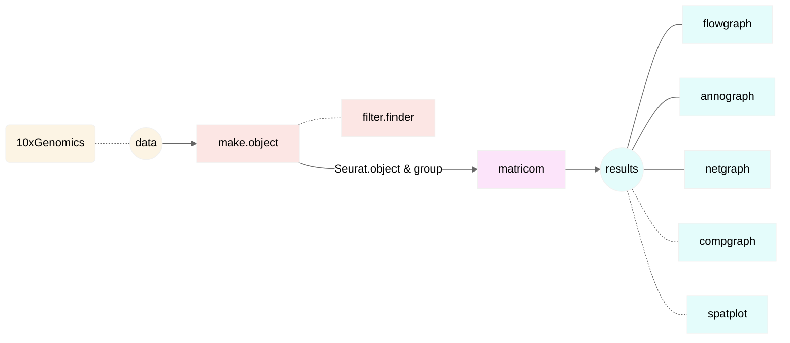
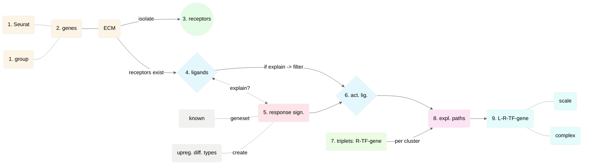
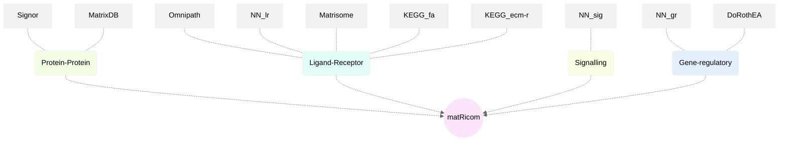

# matRicom: a R package to study cell-extracellular matrix communication in single-cell RNA-seq data.

* Author and maintainer: IzziLab (<valerio.izzi@oulu.fi>)
* Application note: doi: *pending*
* Supplementary data: [matRicom-suppData](https://github.com/Izzilab/matRicom-suppData)

## Abstract
**Motivation:** Single-cell RNAseq (scRNA-seq) enables the study of cell-cell communication within entire tissues, organs and systems. While the relative composition of the extracellular matrix (ECM) - a complex meshwork of extracellular proteins with scaffolding, enzymatic and signaling activities necessary to multicellular organization - can be studied at high detail with scRNA-seq, its role in transducing signals to nearby cells cannot be studied equally in depth with existing packages.  
**Results:** Here we present MatRicom, a R package to study cell-ECM communication in scRNA-seq data. MatRicom wraps functions from existing packages as well as custom algorithms, databases and visualizations to tailor modelling of the signal diffusion models to ECM-cell interactions. Results show that matRicom adds to existing packages, outperforming them in detailing communication systems where ECM plays a role and offering novel possibilities for the study of large-scale communication systems.

## Installation
`matRicom` dependencies are: `nichenetr`, `ggalluvial`, `webr`, `glmnet`, `visNetwork`. On a stock R environment (no third-party packages installed), follow these steps:
```R
install.packages("BiocManager")
BiocManager::install("ComplexHeatmap")
install.packages("githubinstall")
BiocManager::install("limma")
devtools::install_github("saeyslab/nichenetr")
install.packages("ggalluvial")
install.packages("webr")
install.packages("glmnet")
install.packages("visNetwork")
devtools::install_github("izzilab/matRicom")
```
A few notes about Linux users:
```R
# If installation of `devEMF` (dependency of `webr`) fails, download the tarball
# (https://cran.r-project.org/web/packages/devEMF/index.html), change the shebang
# of the configure script to /bin/bash, then install from the archive:
install.packages("./devEMF-4.1-1.tar.gz")

# You may need to explicitly install (for spatial data analysis) these:
# hdf5 (https://hdfgroup.org/) -- a dependency outside R; installation method
# depends on your distribution
BiocManager::install("rhdf5")
install.packages("hdf5r")
```

The libraries should load automatically. However, if manual loading is required, this is the full list:
```R
library("dplyr")
library("data.table")
library("crayon")
library("Seurat")
library("nichenetr")
library("purrr")
library("ggplot2")
library("ggalluvial")
library("webr")
library("glmnet")
library("scales")
library("igraph")
library("visNetwork")
library("Matrix")
library("rhdf5") # for spatial data
library("hdf5r") # for spatial data
library("matRicom")
```
## Functions provided by the package
The matRicom R package provides the following funtions (given in the relative order of their typical usage):
1. Preparation
   * `make.object`: a wrapper around the [Seurat workflow](https://satijalab.org/seurat/articles/pbmc3k_tutorial.html) to prepare 10X data for `matricom`
   * `make.object.spatial`: a wrapper around the [spatial datasets with Seurat](https://satijalab.org/seurat/archive/v3.2/spatial_vignette.html) to prepare 10X_Spatial data for `matricom.spatial`
   * `filter.finder:` a graphical utility to explore filters (such as `exp.filter` and `min.pct`) for matRicom
2. Main function
   * **`matricom`**: cell-ECM communications in scRNAseq data
   * `matricom.spatial`: cell-ECM communications in Spatial RNAseq data
3. Post-run analyses
   * `flowgraph`: representing cell-ECM communications with alluvials
   * `annograph`: matrisome annotations with nested pie charts
   * `netgraph`: representing cell-ECM communications with networks, focusing on intracellular paths
   * `compgraph`: representing differential cell-ECM communications with alluvials
   * `spatplot`: representing cell-ECM communication in spatial RNAseq data

## Example usage
The workflow (Figure 1) has 3 automated steps for the user to carry out:
1. Input data should be prepared as a Seaurat object. For 10xGenomics data, this can be done automatically by `make.object`.
   * (optional) Explore your data by `filter.finder` if you want to set custom filtering in the next step.
2. The prepared data and a defined group column (to serve as identity factor) are then passed to `matricom`, the main function of the package.
3. Results can be analyzed and visualised by several functions: `flowgraph`, `compgraph`, `netgraph` and `spatplot`.

*Notes*
* For Spatial datasets, use `make.object.spatial` and `matricom.spatial`, instead.  
* If input has [multiple data types](https://www.10xgenomics.com/resources/analysis-guides/tag-assignment-of-10x-Genomics-cellplex-data-using-seurats-htodemux-function), option `data.multiple = T` should be passed to function `make.object`, otherwise it will stop with a warning like this: "*10X data contains more than one type and is being returned as a list containing matrices of each type*". The option is **not** available for `make.object.spatial`.
* matRicom is designed for data from _Homo sapiens_. To try it with other species (such usage is discouraged), option `dirty.trick = T` should be passed to `make.object(.spatial)`; it simply puts gene names to uppercase (hence the name).
 

>**Figure 1. matRicom user workflow.** Raw data is processed by `make.object`, then parsed to `matricom`.

For preparing data from [NicheNet](https://github.com/saeyslab/nichenetr), check the [Supplemental 0_matRicom_singlecell data prep.R](./supp/Supplemental%200_matRicom_singlecell%20data%20prep.R) script. Extensive usage examples are provided by [Supplemental 4_matRicom_usage examples script.R](./supp/Supplemental%204_matRicom_usage%20examples%20script.R) script. Short, at-a-glance demonstrations of single cell and spatial dataset analyses are provided below (highlighted in the Test runs section).

### Single cell dataset
Let's use the following dataset from the [10xGenomics](https://www.10xgenomics.com/resources/datasets) project: [PBMCs from a Healthy Donor: Whole Transcriptome Analysis)](https://www.10xgenomics.com/resources/datasets/pbm-cs-from-a-healthy-donor-whole-transcriptome-analysis-3-1-standard-4-0-0).
* Clicking on *Gene Expression - Feature / cell matrix (filtered)* will download:
  * `Parent_NGSC3_DI_PBMC_filtered_feature_bc_matrix.tar.gz`
* Extracting the archive, will produce sub-folder `filtered_feature_bc_matrix/` with the following contents:
  * `barcodes.tsv.gz`
  * `features.tsv.gz`
  * `matrix.mtx.gz`

```R
# Navigate to work dir, e.g:
setwd("/path/to/filtered_feature_bc_matrix")

# Prepare the data as a Seurat object
pbmc.seurat <- make.object(data.name = "pbmc", data.dir = "./")

# Optionally save to disk and read from disk before next step
saveRDS(pbmc.seurat, "pbmc.seurat.RDS")
pbmc.seurat <- readRDS("./pbmc.seurat.RDS")

# To help you select expr.filter and min.pct, different from the default (0.3 and 1), explore data:
filter.finder(seurat.obj = pbmc.seurat, group.column = "seurat_clusters")

# Run matricom main function
pbmc.out <- matricom(seurat.obj = pbmc.seurat, group.column = "seurat_clusters")

# Export the results?
write.csv(pbmc.out, file="pbmc.csv", row.names = F, quote = F)

# Some post-run analyses?
flowgraph(result.obj = pbmc.out)
netgraph(result.obj = pbmc.out)
annograph(result.obj = pbmc.out)
```

### Spatial dataset
Analogously to above, let's use: [Human Lung Cancer (FFPE)](https://www.10xgenomics.com/resources/datasets/human-lung-cancer-ffpe-2-standard)
* Clicking on *Feature / barcode matrix HDF5 (filtered)*, *Feature / barcode matrix (filtered)* and *Spatial imaging data* will download:
  * `CytAssist_FFPE_Human_Lung_Squamous_Cell_Carcinoma_filtered_feature_bc_matrix.h5`
  * `CytAssist_FFPE_Human_Lung_Squamous_Cell_Carcinoma_filtered_feature_bc_matrix.tar.gz`
  * `CytAssist_FFPE_Human_Lung_Squamous_Cell_Carcinoma_spatial.tar.gz`
* Extracting the archives will produce, respective folders:
  * `filtered_feature_bc_matrix/`
  * `spatial/`
* Place `spatial/` and the `*.h5` file within `filtered_feature_bc_matrix/`

```R
setwd("/path/to/filtered_feature_bc_matrix")
lc.seurat <- make.object.spatial(data.name = "lc", data.dir = "./", h5.filename = "CytAssist_FFPE_Human_Lung_Squamous_Cell_Carcinoma_filtered_feature_bc_matrix.h5")
lc.out <- matricom.spatial(seurat.obj = lc.seurat, group.column = "seurat_clusters")
```

## matRicom pipeline
Running `matricom` will list the progress through the individual steps of the pipeline (Figure 2) and report issues/warnings, if there are any:

```
(1/9) loading matRicom objects... done 
(2/9) evaluating active matrisome genes in cells... done 
(3/9) evaluating matrisome receptor genes in target population(s)... done 
(4/9) extracting potential matrisome ligands based on receptors... done 
(5/9) creating population-specific response geneset(s)...done 
(6/9) testing potential ligand(s) against response genesets (clipping of ligands might occurr if > max.ligands)... done 
(7/9) forming triplets (clipping of targets might occurr if > max.targets)... done 
(8/9) finding explainable paths... done 
(9/9) scaling the results to [0,1] and annotating... done
```

>**Figure 2. matRicom pipeline.** Following reading of the input data (1), ECM genes expressed at sufficient levels (e.g. 30% of a cell population, or 30% of all cell types) are considered (2). From them, matRicom focuses on the genes of known receptors (3) and ligands (4) pairs that are found in the data. Then, *response signatures* are extracted (5), from a vector of response genes that is either user-provided (known geneset), or automatically created from upregulated differential types. If the present ligands can account for the response signatures (4 ↔ 5), they are sorted out as potentially *active ligands* (6). Triplets of Receptors - transcription factors - response genes (R-TF-gene) are then defined (7). For the triplets, matRicom aims to find explainable paths (8), in regards of the active ligands (6), by a quick differential correlation. Finally, Ligands - Receptors - Transcription factors - genes (L-R-TF-gene) are reported(9). Results are scaled, also reporting whether the receptors belong to a complex.

## Supplemental scripts
- [Supplemental 0_matRicom_singlecell data prep.R](./supp.scripts/Supplemental%200_matRicom_singlecell%20data%20prep.R): creation of single cell data objects.
- [Supplemental 1_matRicom_database prep script.R](./supp.scripts/Supplemental%201_matRicom_database%20prep%20script.R): Network creation script (Figure 3).


**Figure 3. Databases incorporated in matRicom.** Databases: [NicheNet](https://github.com/saeyslab/nichenetr) NN_sig (signaling), NN_lr (ligand-receptor) and NN_gr (gene regulatory) interactions networks; [SIGNOR database](https://signor.uniroma2.it/downloads.php) causal interactions data; [MatrixDB](http://matrixdb.univ-lyon1.fr/) IMEX-extended database interactions by ECM proteins; data from KEGG_fa ([focal adhesion](https://www.genome.jp/pathway/hsa04510)) and ECM_ecm-r ([ECM-receptor interaction](https://www.genome.jp/pathway/hsa04512)); [DoRothEA](https://saezlab.github.io/dorothea/); [Matrisome](https://matrisomedb.org/) ligand targets, [Omnipath](https://omnipathdb.org/) ligand-receptor stimulation. The respective class of interactions is shown on the middle row.

- [Supplemental 2_matRicom_database comparison script.R](./supp.scripts/Supplemental%202_matRicom_database%20comparison%20script.R): Source evaluation script, requires `eulerr`.
- [Supplemental 3_matRicom_performance comparison script.R](./supp.scripts/Supplemental%203_matRicom_performance%20comparison%20script.R): Performance evaluation script, requires `eulerr` and `tidyverse`.
- [Supplemental 4_matRicom_usage examples script.R](./supp.scripts/Supplemental%204_matRicom_usage%20examples%20script.R): Usage example script, all data are available online at https://doi.org/10.5281/zenodo.7385244

## Test runs
Testing results are available at [matRicom-testRuns](https://github.com/Izzilab/matRicom-testRuns/) repository (the input data should be downloaded from 10xGenomics). matRicom was successfully tested on the following datasets (datasets used as examples above are in **bold**):
* Single Cell Gene Expression
  * 3' Targeted Demonstration (v3.1 Chemistry):
    * Hodgkin's Lymphoma, Dissociated Tumor: Whole Transcriptome Analysis 
    ([url](https://www.10xgenomics.com/resources/datasets/hodgkins-lymphoma-dissociated-tumor-whole-transcriptome-analysis-3-1-standard-4-0-0)) 
    ([test](https://github.com/Izzilab/matRicom-testRuns/tree/main/10xGenomics/Single_Cell_Gene_Expression/3_Targeted_Demonstration_v3.1_Chemistry/Hodgkins_Lymphoma_Dissociated_Tumor_Whole_Transcriptome_Analysis/))
    * **PBMCs from a Healthy Donor: Whole Transcriptome Analysis**
    ([url](https://www.10xgenomics.com/resources/datasets/pbm-cs-from-a-healthy-donor-whole-transcriptome-analysis-3-1-standard-4-0-0))
    ([test](https://github.com/Izzilab/matRicom-testRuns/tree/main/10xGenomics/Single_Cell_Gene_Expression/3_Targeted_Demonstration_v3.1_Chemistry/PBMCs_from_a_Healthy_Donor_Whole_Transcriptome_Analysis/))
  * Cellplex Demonstration Data (v3.1 Chemistry):
    * 10k Human PBMCs Multiplexed, 2 CMOs
    ([url](https://www.10xgenomics.com/resources/datasets/10-k-human-pbm-cs-multiplexed-2-cm-os-3-1-standard-6-0-0))
    ([test](https://github.com/Izzilab/matRicom-testRuns/tree/main/10xGenomics/Single_Cell_Gene_Expression/Cellplex_Demonstration_Data_v3.1_Chemistry/10k_Human_PBMCs_Multiplexed_2_CMOs/))
    * 10k Monkey PBMCs Multiplexed, 2 CMOs
    ([url](https://www.10xgenomics.com/resources/datasets/10-k-monkey-pbm-cs-multiplexed-2-cm-os-3-1-standard-6-0-0))
    ([test](https://github.com/Izzilab/matRicom-testRuns/tree/main/10xGenomics/Single_Cell_Gene_Expression/Cellplex_Demonstration_Data_v3.1_Chemistry/10k_Monkey_PBMCs_Multiplexed_2_CMOs/))
    * 10k Mouse PBMCs Multiplexed, 2 CMOs
    ([url](https://www.10xgenomics.com/resources/datasets/10-k-mouse-pbm-cs-multiplexed-2-cm-os-3-1-standard-6-0-0))
    ([test](https://github.com/Izzilab/matRicom-testRuns/tree/main/10xGenomics/Single_Cell_Gene_Expression/Cellplex_Demonstration_Data_v3.1_Chemistry/10k_Mouse_PBMCs_Multiplexed_2_CMOs/))
    * 10k Rat PBMCs Multiplexed, 2 CMOs
    ([url](https://www.10xgenomics.com/resources/datasets/10-k-rat-pbm-cs-multiplexed-2-cm-os-3-1-standard-6-0-0))
    ([test](https://github.com/Izzilab/matRicom-testRuns/tree/main/10xGenomics/Single_Cell_Gene_Expression/Cellplex_Demonstration_Data_v3.1_Chemistry/10k_Rat_PBMCs_Multiplexed_2_CMOs/))
* Single Cell Immune Profiling
  * 5' Targeted Mouse Demonstration Data (v2 Chemistry):
    * Mouse Splenocytes: 5'v2 Whole Transcriptome Analysis
    ([url](https://www.10xgenomics.com/resources/datasets/mouse-splenocytes-5-v-2-whole-transcriptome-analysis-2-standard-6-0-1))
    ([test](https://github.com/Izzilab/matRicom-testRuns/tree/main/10xGenomics/Single_Cell_Immune_Profiling/5_Targeted_Mouse_Demonstration_Data_v2_Chemistry/Mouse_Splenocytes_5v2_Whole_Transcriptome_Analysis/))
  * Chromium Connect Demonstration - Human Melanoma (v2 Chemistry):
    * Integrated GEX and VDJ analysis of Connect generated library from human melanoma
    ([url](https://www.10xgenomics.com/resources/datasets/integrated-gex-and-vdj-analysis-of-connect-generated-library-from-human-melanoma-2-standard-6-0-1))
    ([test](https://github.com/Izzilab/matRicom-testRuns/tree/main/10xGenomics/Single_Cell_Immune_Profiling/Chromium_Connect_Demonstration_-_Human_Melanoma_v2_Chemistry/Integrated_GEX_and_VDJ_analysis_of_Connect_generated_library_from_human_melanoma/))
  * Chromium Connect Demonstration - Human PBMCs (v2 Chemistry):
    * Integrated GEX and VDJ analysis of Connect generated library from human PBMCs
    ([url](https://www.10xgenomics.com/resources/datasets/integrated-gex-and-vdj-analysis-of-connect-generated-library-from-human-pbm-cs-2-standard-6-0-1))
    ([test](https://github.com/Izzilab/matRicom-testRuns/tree/main/10xGenomics/Single_Cell_Immune_Profiling/Chromium_Connect_Demonstration_-_Human_PBMCs_v2_Chemistry/Integrated_GEX_and_VDJ_analysis_of_Connect_generated_library_from_human_PBMCs/))
  * Chromium Connect Demonstration - Mouse PBMCs (v2 Chemistry):
    * Integrated GEX and VDJ analysis of Connect generated library from mouse PBMCs
    ([url](https://www.10xgenomics.com/resources/datasets/integrated-gex-and-vdj-analysis-of-connect-generated-library-from-mouse-pbm-cs-2-standard-6-0-1))
    ([test](https://github.com/Izzilab/matRicom-testRuns/tree/main/10xGenomics/Single_Cell_Immune_Profiling/Chromium_Connect_Demonstration_-_Mouse_PBMCs_v2_Chemistry/Integrated_GEX_and_VDJ_analysis_of_Connect_generated_library_from_mouse_PBMCs/))
  * Chromium Connect Demonstration - Mouse Splenocytes (v2 Chemistry):
    * Integrated GEX and VDJ analysis of Connect generated library from mouse splenocytes
    ([url](https://www.10xgenomics.com/resources/datasets/integrated-gex-and-vdj-analysis-of-connect-generated-library-from-mouse-splenocytes-2-standard-6-0-1))
    ([test](https://github.com/Izzilab/matRicom-testRuns/tree/main/10xGenomics/Single_Cell_Immune_Profiling/Chromium_Connect_Demonstration_-_Mouse_Splenocytes_v2_Chemistry/Integrated_GEX_and_VDJ_analysis_of_Connect_generated_library_from_mouse_splenocytes/))
  * Chromium X Series 5' Demonstration (v2 Chemistry):
    * 10k bone marrow mononuclear cells (BMMNCs), 5' v2.0
    ([url](https://www.10xgenomics.com/resources/datasets/10-k-bone-marrow-mononuclear-cells-bmmn-cs-5-v-2-0-2-standard-6-1-0))
    ([test](https://github.com/Izzilab/matRicom-testRuns/tree/main/10xGenomics/Single_Cell_Immune_Profiling/Chromium_X_Series_5_Demonstration_v2_Chemistry/10k_bone_marrow_mononuclear_cells_BMMNCs_5_v2.0/))
    * 20k bone marrow mononuclear cells (BMMNCs), 5' HT v2.0
    ([url](https://www.10xgenomics.com/resources/datasets/20-k-bone-marrow-mononuclear-cells-bmmn-cs-5-ht-v-2-0-2-high-6-1-0))
    ([test](https://github.com/Izzilab/matRicom-testRuns/tree/main/10xGenomics/Single_Cell_Immune_Profiling/Chromium_X_Series_5_Demonstration_v2_Chemistry/20k_bone_marrow_mononuclear_cells_BMMNCs_5_HT_v2.0/))
  * Chromium X Series Demonstration - 20k Human PBMCs, 5' (v2 Chemistry):
    * 20k Human PBMCs, 5' HT v2.0
    ([url](https://www.10xgenomics.com/resources/datasets/20-k-human-pbm-cs-5-ht-v-2-0-2-high-6-1-0))
    ([test](https://github.com/Izzilab/matRicom-testRuns/tree/main/10xGenomics/Single_Cell_Immune_Profiling/Chromium_X_Series_Demonstration_-_20k_Human_PBMCs_5_v2_Chemistry/20k_Human_PBMCs_5_HT_v2.0/))
* Spatial Gene Expression
  * CytAssist Spatial Gene Expression Demonstration (v2 Chemistry)
    * **Human Lung Cancer (FFPE)**
      ([url](https://www.10xgenomics.com/resources/datasets/human-lung-cancer-ffpe-2-standard))
      ([test](https://github.com/Izzilab/matRicom-testRuns/tree/main/10xGenomics/Spatial_Gene_Expression/CytAssist_Spatial_Gene_Expression_Demonstration_v2_Chemistry/Human_Lung_Cancer_FFPE/))
    * Human Melanoma, IF Stained (FFPE)
    ([url](https://www.10xgenomics.com/resources/datasets/human-melanoma-if-stained-ffpe-2-standard))
    ([test](https://github.com/Izzilab/matRicom-testRuns/tree/main/10xGenomics/Spatial_Gene_Expression/CytAssist_Spatial_Gene_Expression_Demonstration_v2_Chemistry/Human_Melanoma_IF_Stained_FFPE/))
    * Mouse Brain Coronal Section 1 (FFPE)
    ([url](https://www.10xgenomics.com/resources/datasets/mouse-brain-coronal-section-1-ffpe-2-standard))
    ([test](https://github.com/Izzilab/matRicom-testRuns/tree/main/10xGenomics/Spatial_Gene_Expression/CytAssist_Spatial_Gene_Expression_Demonstration_v2_Chemistry/Mouse_Brain_Coronal_Section_1_FFPE/))
    * Mouse Brain Coronal Section 2(FFPE)
    ([url](https://www.10xgenomics.com/resources/datasets/mouse-brain-coronal-section-2-ffpe-2-standard))
    ([test](https://github.com/Izzilab/matRicom-testRuns/tree/main/10xGenomics/Spatial_Gene_Expression/CytAssist_Spatial_Gene_Expression_Demonstration_v2_Chemistry/Mouse_Brain_Coronal_Section_2_FFPE/))

**Note**: further tests are undergoing at the moment.
